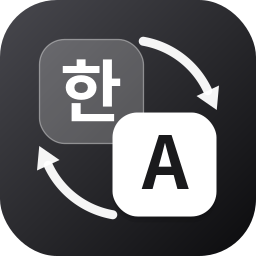

<p align="center">
  
</p>

<h1 align="center">HangulSync</h1>

**한국어** | [English](docs/README.en.md) | [日本語](docs/README.ja.md) | [简体中文](docs/README.zh-CN.md) | [繁體中文](docs/README.zh-TW.md) | [ไทย](docs/README.th.md) | [Русский](docs/README.ru.md) | [Italiano](docs/README.it.md)


HangulSync는 원격 데스크탑 사용 중 발생하는 한글 자소 분리
(`ㅎㅏㄴㄱㅡㄹ`)를 줄이는 macOS 메뉴바 앱입니다.

로컬 Mac과 원격 Mac의 한·영 입력 상태를 동기화합니다.
같은 네트워크에서는 Bonjour로 서로를 찾고,
다른 네트워크에서는 Tailscale을 사용할 수 있습니다.

## 왜 필요한가요?

원격 데스크탑을 사용할 때 두 Mac의 입력 소스가 서로 달라질 수 있습니다.
로컬 Mac은 한글이고 원격 Mac은 영문이면 자소가 분리될 수 있습니다.
반대 상황에서는 입력 대신 Command 단축키가 실행될 수 있습니다.
HangulSync는 두 Mac의 입력 소스를 맞춰 이런 문제를 줄입니다.

## 기능

- **실시간 양방향 동기화**
  한·영 전환이 즉시 전파
- **자동 탐지**
  - 같은 네트워크: **Bonjour** 자동 탐지 (근거리에서는 AWDL P2P Wi-Fi 포함)
  - 다른 네트워크:
    **[Tailscale](https://tailscale.com)**이 켜져 있으면
    같은 tailnet의 피어를 30초마다 탐지
- **언어 기준 대체**
  상대 Mac에 같은 입력기가 없으면 언어가 같은 입력기를 사용
- **루프 방지**
  원격에서 적용된 변경은 재전파되지 않음
- **가볍게 상주**
  메뉴바에서 제어, Dock 아이콘 표시/숨김 선택 가능, 로그인 시 자동 실행 지원
- **다국어 UI**
  한국어, English, 日本語, 简体中文, 繁體中文, ไทย, Русский, Italiano
- **원격 접속 중에만 작동**
  Jump Desktop, 화면 공유, Screens, TeamViewer, AnyDesk, RustDesk 등
  원격 데스크탑 앱이 실행 중일 때만 동기화.
  메뉴에서 항상 켜기로 변경 가능
- **연결 승인**
  새 직접 연결은 사용자가 승인한 뒤에만 입력 상태를 주고받음
- **암호화된 인터넷 릴레이**
  페어링된 Mac은 직접 연결이 없을 때 ntfy를 통해 종단간 암호화된 상태를 주고받음

## 설치 (두 Mac 모두)

> 빌드 없이 사용하려면
> [Releases](https://github.com/catgarret/HangulSync/releases/latest)에서
> 최신 `HangulSync.zip`을 받아 `/Applications`에 넣으세요.
> 첫 실행 시 앱을 우클릭한 뒤 **열기**를 선택하세요.

빌드된 `HangulSync.app`을 복사해도 됩니다.

```bash
git clone https://github.com/catgarret/HangulSync.git
cd HangulSync
./install.sh
```

Xcode Command Line Tools 필요 (`xcode-select --install`).

1. 첫 실행 시 **로컬 네트워크 접근 허용** 팝업에서 반드시 **허용**
2. 메뉴바 `⇄한` / `⇄A` 아이콘 클릭 → **로그인 시 자동 실행** 체크

## 첫 페어링과 Keychain 안내

1. 두 Mac에서 HangulSync를 실행합니다.
2. 두 Mac 중 **한쪽에서만 자동으로 찾기**를 누릅니다.
   다른 Mac에서는 버튼을 누르거나 창을 열 필요 없이 앱만 실행해 두면 됩니다.
3. 찾는 Mac에는 진행 상태가 표시되고,
   다른 Mac에는 연결 승인창이 자동으로 나타납니다.
4. 자동으로 찾지 못하면 어느 한쪽에서 **초대 코드 만들기**를 누릅니다.
   자동 복사된 코드를 2분 안에 다른 Mac의 **초대 코드 입력**에 붙여 넣습니다.
5. 양쪽에 표시된 6자리 코드가 같은지 확인한 뒤 양쪽에서 **승인**합니다.
   **이 기기를 계속 신뢰**를 켜면 이후에는 다시 확인하지 않습니다.
   다음 실행부터는 두 Mac에서 앱만 켜면 자동으로 다시 연결됩니다.
6. macOS가 로그인 Keychain 접근을 요청하면 앱 이름이 HangulSync인지 확인합니다.
   현재 Mac 로그인 암호를 입력하고 **항상 허용** 또는 **허용**을 선택합니다.

암호는 HangulSync 화면에 입력하는 것이 아니라 macOS Keychain 창에만 입력합니다.
취소하면 보안 페어링과 인터넷 릴레이가 작동하지 않습니다.

## 메뉴바 아이콘

| 표시 | 의미 |
|---|---|
| `⇄한` / `⇄A` | 동기화 중 (현재 입력: 한글/영문) |
| `⏸한` / `⏸A` | 일시정지 |
| 흐린 아이콘 | 대기 중 (원격 세션 없음) |

메뉴에서 연결된 Mac 수를 확인할 수 있습니다.
동기화 일시정지와 재개, 원격 앱 실행 중에만 동기화,
로그인 시 자동 실행, 앱 종료를 설정할 수 있습니다.

## 라이선스

MIT © [dongri.me](https://dongri.me/) · AI 바이브코딩으로 만들었습니다.
